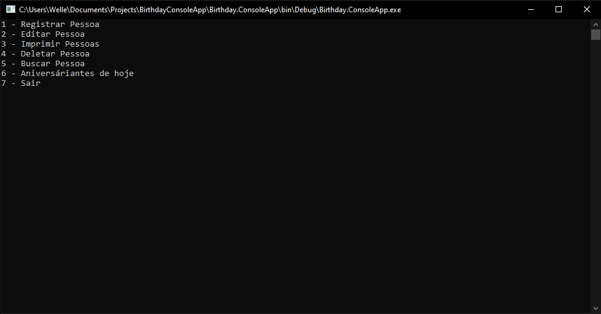
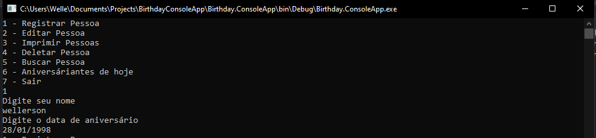

    

   <h1 align="center">Birthday ConsoleApp</h1>

    
    
    

    
 

## Birthday
   Birthday uses `DDD` full `C#` on the backend, I'm making this project to improve
   my skills in the backend.
   
## Initing in the your PC

- For clone the project `git clone https://github.com/Wellers0n/BirthdayConsoleApp.git`
- Open `visual studio` in the folder `BirthdayConsoleApp/`

## Screens

#### Home
  

    
  

  
#### Person list
  

      
  

  
#### Birthday list
  

      
  

  
  #### Register person
  

      
  

  
## Stack used

[C#](https://docs.microsoft.com/pt-br/dotnet/csharp/) 
[.NET](https://docs.microsoft.com/pt-br/dotnet/) 
[Nuget](https://docs.microsoft.com/en-us/nuget/) 

